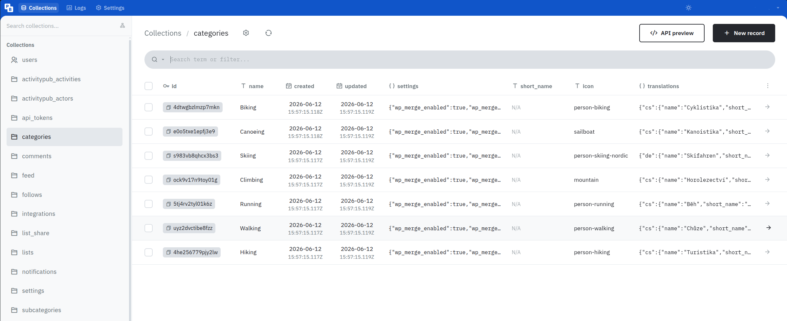
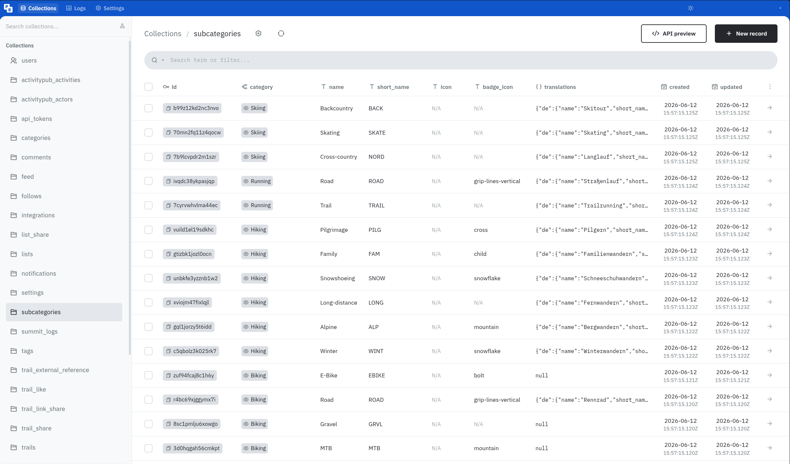

<span class="-tracking-[0.075em]">wanderer</span> uses categories to classify what kind of activity a trail belongs to. 
Out of the box you get: Biking, Canoeing, Climbing, Hiking, Running, Skiing and Walking.
Some broad categories also have subcategories, for example Biking can be refined into MTB, Gravel, Road or E-Bike.
You can adapt this taxonomy to your needs in the PocketBase admin panel.

## Modifying categories



In the PocketBase admin panel, click on the `categories` table in the list on the left side. 
All existing categories will be listed here. 
To edit one simply click on the row, edit the data you want to change, and click "Save". 
To delete a category check the box at the beginning of the row and click "Delete selected". 
To create a new category click the "New record" button in the top right corner, give your new category a name, optionally fill in display metadata such as `short_name`, `icon`, or localized `translations`, and click "Save".

The category `name` is the canonical, language-independent identity.
Use stable names such as `Hiking` or `Biking`; display labels in different languages should be stored in `translations`.
Incoming federated trails and integration imports match categories by a normalized version of `name`, so changing a category name can affect future matching.

### Category fields

| Field | Description |
| ----- | ----------- |
| `name` | Canonical category name. This is used for matching across imports and federation. |
| `short_name` | Optional compact label for space-constrained UI. |
| `icon` | Optional Font Awesome Free icon name without the `fa-` prefix, for example `person-hiking`. |
| `translations` | Optional localized display labels. |
| `settings` | Optional JSON settings for category-specific backend behavior. |

`translations` uses supported base locale codes such as `de`, `en`, `fr`, or `pt` as keys.
Do not use region-specific keys such as `de-CH` or `pt-BR`; the frontend resolves user locales to their base locale before looking up category translations.

Example:

```json
{
  "de": {
    "name": "Radfahren",
    "short_name": "RAD"
  },
  "en": {
    "name": "Biking",
    "short_name": "BIKE"
  }
}
```

## Modifying subcategories

Subcategories live in the `subcategories` table and act as optional refinements below a single parent category. Their names only need to be unique within that parent, so `Road` can exist under both Biking and Running at the same time.



To add one, create a new record in `subcategories`, choose its parent `category`, set a canonical `name`, and optionally add display metadata.

### Subcategory fields

| Field | Description |
| ----- | ----------- |
| `category` | Required parent category. |
| `name` | Canonical subcategory name, unique within the parent category after normalization. |
| `short_name` | Compact label shown in icon-based filters, for example `MTB`, `GRVL`, or `ROAD`. |
| `icon` | Optional Font Awesome Free icon name. If empty, the parent category icon is used. |
| `badge_icon` | Optional Font Awesome Free overlay icon, for example `snowflake`, `mountain`, `bolt`, or `cross`. |
| `translations` | Optional localized display labels, using the same structure as category translations. |

Most subcategories should reuse the parent category's icon and rely on `short_name` — plus a `badge_icon` where it helps — to set themselves apart, rather than each carrying a distinct full icon. You can browse available icon names at [fontawesome.com](https://fontawesome.com/search?ic=free-collection).

:::note
Unknown remote categories and subcategories are not automatically created during federation.
Raw remote values are stored on the trail and can be matched later when an admin creates a compatible local category or subcategory.
:::

## Migrating old custom categories

If your instance already had custom categories such as `MTB` or `Gravel` that now overlap with a default subcategory, you can reassign the affected trails in bulk from the web UI. See [Categories](/use/categories/#editing-several-trails-at-once) for the step-by-step migration path.

## Category settings

Categories can optionally define additional settings in the `settings` JSON field.
This field may be left empty.
When no settings are configured, <span class="-tracking-[0.075em]">wanderer</span> uses the built-in defaults.

Currently, the following setting is supported:

```json
{
  "wp_merge_enabled": true,
  "wp_merge_radius": 50
}
```

`wp_merge_enabled` controls whether geotagged photos are grouped into waypoint clusters.
Set it to `false` to create one waypoint per photo.

`wp_merge_radius` controls how close geotagged photos have to be to each other, in meters, before they are grouped into the same waypoint when adding waypoint photos to a trail.
Set it to `0` to only merge photos with the exact same coordinates, or increase the value to merge photos across a wider area.
