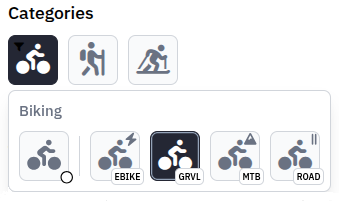
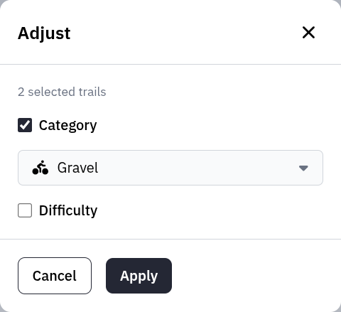
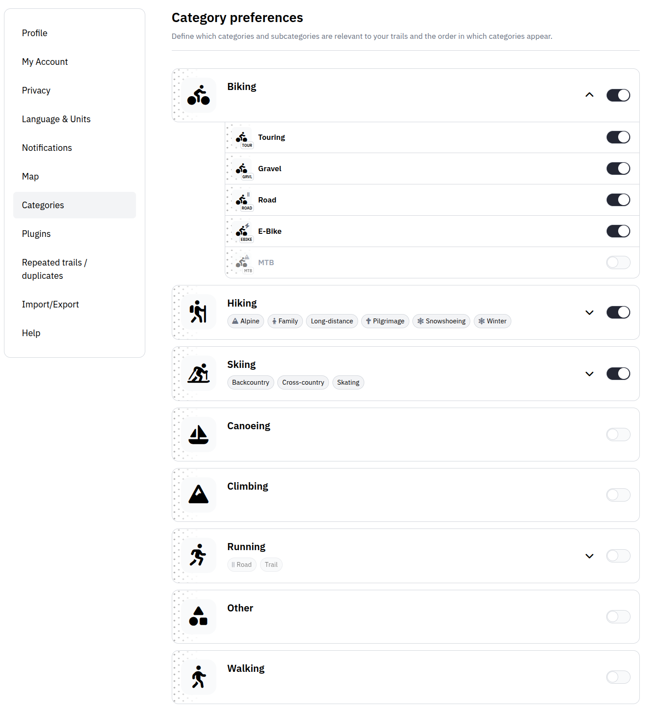

Every trail has a category that describes its broad activity type — Hiking, Biking, Running, Skiing, and so on. Many categories can be narrowed down further with a subcategory, such as Biking / Gravel or Hiking / Snowshoeing, whenever you want to be more specific.

## Choosing a category

When you create or edit a trail, pick the activity type with the **Category** selector in the trail form. It lists the broad categories together with their subcategories, so you can stay general or get specific:

- Choose **Hiking** for an ordinary hiking trail.
- Choose **Hiking / Snowshoeing** to mark it as a snowshoe route.
- Choose **Biking / Gravel** for a gravel ride.

A broad category on its own is always enough; a subcategory is optional. On trail cards and in lists, the category icon carries a small badge for subcategories that need one — for example a snowflake for winter variants — so you can tell refinements apart at a glance.

## Filtering trails

The filter panel shows each category as an icon. Click an icon to add that category to the filter.

Categories that have subcategories reveal a subcategory overlay when you hover or focus the icon; on touch devices, long-press it instead. From there you can filter by:

- the whole category,
- only trails that have no subcategory, or
- one or more specific subcategories.

When a subcategory filter is active, a small indicator appears on the category icon — that's how you tell "all Biking trails" apart from "only the Biking subcategories I picked".

## Editing several trails at once

To reclassify many trails in one go, select them in the trail list, open the action menu, and choose **Adjust**. The modal lets you set a new category, subcategory, or difficulty for the whole selection.

This is handy after upgrading an instance, when an older standalone category overlaps with a new subcategory: every trail previously filed under `Gravel`, for instance, can be moved to Biking / Gravel in a single step.

## Category preferences

Open **Settings → Categories** to control how categories behave for your account.

Each category has one visibility toggle:

- **Show** controls whether the category is part of your exploration and planning. While it is on, the category appears in search and discovery and is offered in the category picker when you create or edit a trail. Turn it off to hide all trails in that category from those places, including federated trails from other instances.

You can **reorder** categories by dragging them. This order carries over to pickers and filters, and it also decides which category is preselected when you create a new trail. New accounts start with Hiking as the first category unless an older favourite-sport setting is migrated.

Categories with subcategories can be expanded. Inside the expanded section, each subcategory has its own visibility toggle and can be reordered by dragging. Hidden subcategories appear muted and drop out of your pickers and filters; hiding a parent category also hides its subcategories. When a category is collapsed, the compact badges below the category name show which subcategories belong to it.

These settings are personal. They never delete categories, change other users' settings, or remove category assignments that already exist on trails.

:::note
Categories and subcategories themselves are defined by the instance administrator in PocketBase. As a regular user you choose from the available taxonomy and set your own visibility preferences, but you cannot create global categories from the web UI.
:::
